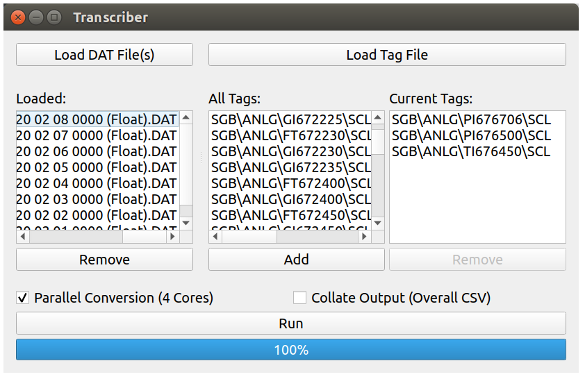

# Transcriber

Rapidly convert FactoryTalk SE DAT files to useful CSV files.

## Features
- Up to 12,000 times faster than previous methods:
  
  |Method     |Time (Per File)|
  |-----------|--------------:|
  |Previous   |~240 s         |
  |Transcriber|0.02 s         |

  *Note: conversion time is hardware dependent and is linear with the number of tags selected and the DAT file size.
  The above was observed using a quad-core i5 laptop (ubuntu), with 1.6 GB/s read.*
- Parallel conversion makes the most of your CPU.
- Built-in collation means data analysis is a piece of :cake:!
- Ability to average rows so file size can be reduced.
- Sensible file format (CSV):

  |Date      |Time    |Example Tag|(Other Selected Tags)|
  |----------|--------|-----------|---------------------|
  |01/01/2020|00:00:00|5.99023199 |...                  |
  |01/01/2020|00:00:08|5.97069597 |...                  |
  |...       |...     |...        |...                  |

- Optimised DAT file parsing: up to 2400 times faster than stock `dbfread`:
  
  |Class     |Time (Per File)|
  |-----------|--------------:|
  |`dbfread.DBF`         |~38 s   |     |
  |subclassed `dbfread.DBF`|0.016 s |         |

## Latest Releases (Downloads)

The latest Windows and Linux builds can be found in [releases](https://github.com/ewancook/transcriber/releases).

## Installing from Source

Build scripts are being updated. Read `.travis.yml` in the meantime.

*Note: Python 3.6+ is required.*

## Usage

*Note: multiple selection is possible for all files and tags.*

---

### Load Float File(s)

Specify the FactoryTalk SE DAT files to transcribe by clicking `Load Float File(s)`. These commonly have the format:

    "DATE START_TIME (Float).DAT"

To remove files, select them and click `Remove`.

*Note: if collating, files will be collated in the order added. This allows custom ordering.*

---
### Load Tag File

Specify a FactoryTalk SE tag file to be parsed by clicking `Load Tag File`. These commonly have the format:

    "DATE START_TIME (Tagname).DAT"

An error message will be shown if the file cannot be parsed.

---
### Adding/Removing Tags

To add tags, select them and click `Add`. To remove tags, select them and click `Remove`.

*Note: Transcriber will not run with no tags selected.*

---
### Parallel Conversion

Enabling `Parallel Conversion (Cores)` allows Transcriber to use the selected number of CPU cores to transcribe files simultaneously.

*Note: files will not necessarily be transcribed in the order specified. This has no impact on collation.*

---
### Collation

Enable `Collation` if an overall CSV file containing back-to-back data from all files is required. Sort files by name (`Sort by Name`) or enable `Drag to Rearrange Files` for custom ordering.

*Note: this produces an additional file.*

---
### Average Rows

Enable `Average every 'N' Rows` to reduce data precision and file size. This setting combines every 'N' rows to give averaged values for each tag. The initial date and time are used.

*Note: Transcriber does not explicitly calculate time-averages. Time increments are constant, so results are inherently time-averaged.*

---
### Decimal Places

Enable `Set Decimal Places` to select the number of decimal places in the converted files.

---
### Run

It's as easy as that!

Transcriber will attempt to parse all Float files selected. An error message will be shown if files cannot be transcribed.

Transcribed files are created in the same directories as the original files and have the format:

    "ORIGINAL_NAME (Transcribed).csv"

---

## License
This project is licensed under the MIT License. See the [LICENSE](LICENSE) file for details.
